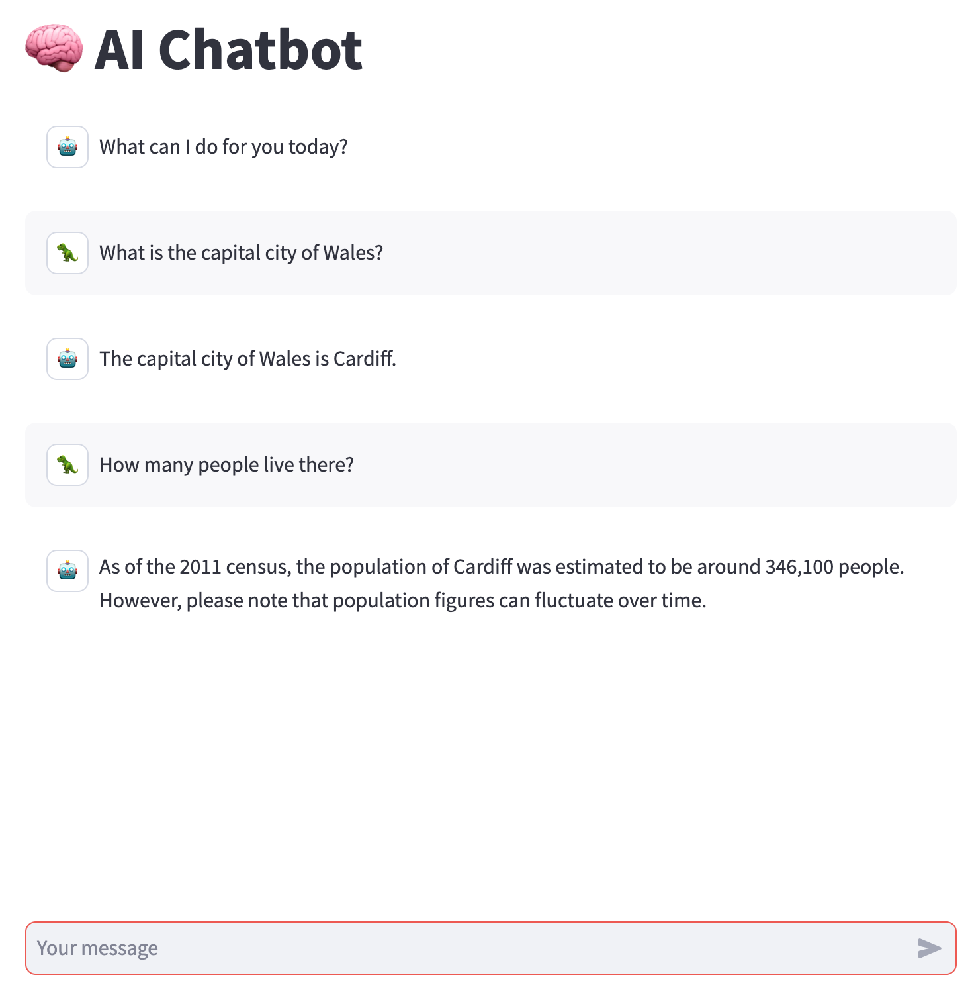

# Generative AI Examples in Python
This repository contains a series of examples to investigate the use of the Open AI API and Langchain packages in Python.

## Example One
Use the Open AI API to retrieve a list of the available LLM models

```
poetry run python example_one.py
```

## Example Two
Use the python_dotenv package to work with the API secret.  

Create a .env file in the repository root and add:
```
OPENAI_API_KEY=<your_key>
```

Ensure your .env file is *never* checked in to source control, it needs to be added to the .gitignore to ensure this.

example_two.py then uses the Open AI API ChatCompletion endpoint to send a message to ChatGPT and print the response.

```
poetry run python example_two.py
```

## Example Three
Builds upon the first two examples to create a simple CLI tool that asks a question of chatGPT
and returns an answer.
```
poetry run python example_three.py
```

Example output:
```
Command Line Assistant
======================
1: Ask a question
Q/q: Quit
Enter choice: 1
What is your question? 
How many letters in the word red?
Replying....
There are 3 letters in the word "red".
Do you have another question? (Y/y to continue, anything else to quit) 
```

### Limitations
This example has a limitation that chatGPT will not remember the context of a conversation, as shown in the example below. Example Four will show how to retain context when querying ChatGPT.

```
Command Line Assistant
======================
1: Ask a question
Q/q: Quit
Enter choice: 1
What is your question? 
Which city in wales has the highest population?
Replying....
Cardiff is the city in Wales with the highest population.
Do you have another question? (Y/y to continue, anything else to quit) 
y


What is your question? 
How many people live there?
Replying....
I'm sorry, could you please clarify which place or area you are referring to?
```

## Example Four
Upgrade the CLI assistant to retain context of the conversation.

```
poetry run python example_four.py
```

Example Output:
```
Command Line Assistant v2
=========================
1: Ask a question
Q/q: Quit
Enter choice: 1
What is your question? 
What is the largest city in Wales?
Replying....
Answer....
The largest city in Wales is Cardiff.
Do you have another question? (Y/y to continue, anything else to quit) 
y


What is your question? 
How many people live there?
Replying....
Answer....
As of the latest estimates in 2021, the population of Cardiff is approximately 498,660 people.
Do you have another question? (Y/y to continue, anything else to quit) 
```

## Example Five
Upgrade the CLI assistant to calculate the token usage for a conversation.

This example uses the tiktoken package calculate token usage for a conversation exchange with chatGPT

```
poetry run python example_five.py
```

```
Command Line Assistant v3
=========================
1: Ask a question
2: Calculate token usage
Q/q: Quit
Enter choice: 2
What is your question? 
What is the capital city of Wales?
Replying....
Tokens calculated
---------------------------
prompt: 15
calc reply:8
calc total tokens:23
Token usage in reply
---------------------
prompt tokens: 15
completion tokens: 8
total tokens: 23
Answer....
The capital city of Wales is Cardiff.
Do you have another question? (Y/y to continue, anything else to quit) 
y


What is your question? 
How many people live there?
Replying....
Tokens calculated
---------------------------
prompt: 37
calc reply:19
calc total tokens:56
Token usage in reply
---------------------
prompt tokens: 37
completion tokens: 19
total tokens: 56
Answer....
As of 2021, the estimated population of Cardiff is around 478,000 people.
Do you have another question? (Y/y to continue, anything else to quit) 
q
Come back soon!
```

## Example Six
Add a simple web based user interface using the streamlit package. This interface allows the user to ask a single question and display the answer.

```
poetry run streamlit run ai_examples/example_six.py
```


### Key Points
Uses a simple streamlit dropdown and form to allow the user to either ask a question or ask a question and calculate token usage.

Functions from prior examples are reused to trigger the requests to OpenAI and calculate tokens.

A new function format_tokens is introduced to format the token useage as a string which streamlit appends to the llm answer and prints using st.markdown() 

### Limitations
Click 'clear answer' or refresh the browser to ask a new question

This example does not provide a chain of conversation (i.e memory)

Although a dropdown is provided, the example is limited to the gpt-3.5-turbo llm model use

## Example Seven
Use the streamlit chat functionality to provide ChatGPT like interface using the OPEN AI API. This code also shows how to change avatars from the streamlit default.

```
poetry run streamlit run ai_examples/example_seven.py
```


### Key Points
The code follows the example from the [Streamlit website](https://streamlit.io/generative-ai)

If an API Key is not configured the app will display a message

Session state is used to retain the message thread

### Next Steps
Consider adding an option to display the tokens used in the prompt and reply

# AI LangChain Examples
LangChain is a framework that abstracts much of the setup required to interact with multiple LLMs (not specifically OpenAI, although these examples focus on OpenAI).

All examples are under ai_examples/langchain_examples

## Example One
A simple question and answer Streamlit UI using Streamlit and LangChain with OpenAI.

```
poetry run streamlit run ai_examples/langchain_examples/example_one.py
```

## Example Two
A chat based Streamlit UI example using a LangChain agent and custom tools to implement a simple RAG (Retireval Augmentation Generation) application.

This example uses Serper to provide extarnal search for OpenAI, meaning the llm can look up current events.  The search tool is defined as a custom LangChain tool.  A serper API key will need to be generated at [serper.dev](https://serper.dev)

A native LangChain tool **llm-math** is defined to enable the agent to perform calculations.  OpenAI is not reliable for mathematical calculations due to the way the language model uses word association to derive it's answers, by using a tool the agent can defer anything that requires a calculation to the [llm-math tool](https://python.langchain.com/cookbook#:~:text=the%20llmcheckerchain%20function.-,llm_math.ipynb,-Solve%20complex%20word).

A custom Langchain tool is defined from a python function to show how bespoke code can be run as part of a LangChain Agent's reasoning chain. In this example a simple function that returns a random animal from a predefined list is defined as a LangChain tool. 

Tools will allow the agent to use the OpenAI LLM to reason about the question being asked and choose the right tools to answer the question that is posed. For example asking:

*Select a random animal and tell me a fun fact*

will cause the agent to reason:

*I need to get a random animal using the random animal generator tool.* 

*Then I need to search for a fun fact about that animal using the search tool*

**StreamlitCallbackHandler** is used to write the Langchain agents thoughts back to streamlit so that the reasoning is visible to the user.


## License
See [LICENSE](LICENSE)